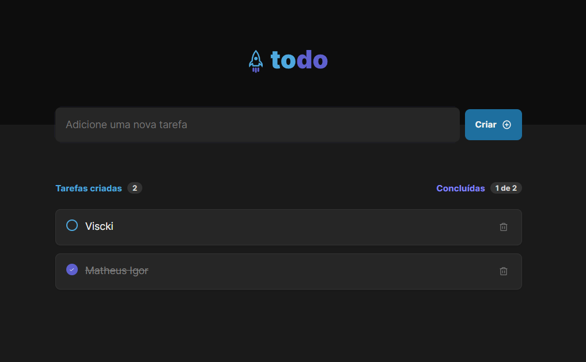

<h1 align="center">Todo List</h1>
<p align="center">Mark and unmark your tasks with this application.</p>


## Features
+ [x] Create a task
+ [x] List tasks
+ [x] Delete a task
+ [x] Mark and unmark a task as done

## Technologies
+ [React](https://react.dev/)
+ [Typescript](https://www.typescriptlang.org/)
+ [Radix](https://www.radix-ui.com/)
+ [Styled Component](https://styled-components.com/)

## How to use
Clone the project and execute the following commands to run it.
```node
npm install
```
```node
npm run dev
```

## Final Project


